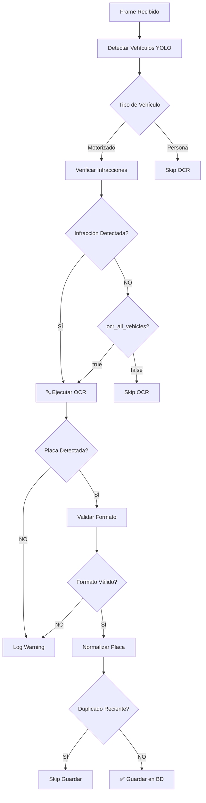

# Sistema OCR Universal para Detección de Placas

## 📋 Descripción General

El sistema de detección de placas con OCR está **completamente integrado** para todos los tipos de infracciones. El OCR se ejecuta automáticamente cuando se detecta cualquier tipo de infracción en un vehículo motorizado.

## 🎯 Tipos de Infracciones Soportadas

### ✅ Infracciones con OCR Automático

| Tipo | Código | Descripción | Requisitos |
|------|--------|-------------|------------|
| 🚗 Exceso de Velocidad | `speeding` o `speed` | Vehículo excede límite de velocidad | `simulate_infractions=true` O tracking real |
| 🚦 Semáforo Rojo | `red_light` | Vehículo cruza línea con luz roja | `traffic_light_state='red'` y `stop_line_y` |
| 🛣️ Invasión de Carril | `wrong_lane` | Vehículo cruza línea de carril | Líneas detectadas + distancia < threshold |
| 🪖 Sin Casco | `no_helmet` | Motociclista sin casco | Detección de persona en moto |
| 🔒 Sin Cinturón | `no_seatbelt` | Conductor sin cinturón | Detección visual |

## 🔧 Configuración

### Parámetros de Config WebSocket

```json
{
  "infractions": ["speeding", "wrong_lane", "red_light"],
  "confidence_threshold": 0.5,
  "enable_speed": true,
  "enable_lane_detection": true,
  "speed_limit": 60,
  "simulate_infractions": true,
  "stop_line_y": 400,
  "ocr_all_vehicles": false
}
```

### Parámetros Importantes

#### `ocr_all_vehicles` (boolean, default: false)
- **`false`**: OCR solo se ejecuta en vehículos con infracciones ✅ **RECOMENDADO**
- **`true`**: OCR se ejecuta en TODOS los vehículos motorizados (consume más recursos)

#### `infractions` (array)
Lista de tipos de infracciones a detectar:
- `"speeding"` o `"speed"` - Exceso de velocidad
- `"wrong_lane"` - Invasión de carril
- `"red_light"` - Semáforo en rojo
- `"no_helmet"` - Sin casco
- `"no_seatbelt"` - Sin cinturón

#### `simulate_infractions` (boolean)
- **`true`**: Modo simulación (genera infracciones aleatorias) - útil para pruebas
- **`false`**: Modo real (detecta infracciones reales)

## 📊 Flujo de Detección



## 🔍 Proceso de OCR

### 1. Detección de Infracción
El sistema primero detecta si hay una infracción:

```python
# Ejemplo de detección de speeding
if estimated_speed > speed_limit:
    infraction_type = 'speed'
    infraction_data = {
        'detected_speed': estimated_speed,
        'speed_limit': speed_limit,
        'vehicle_type': vehicle_type
    }
```

### 2. Ejecución de OCR (Automática)
Si se detecta una infracción, el OCR se ejecuta automáticamente:

```python
if infraction_type:
    logger.info(f"🚨 INFRACTION DETECTED: {infraction_type}")
    
    if not license_plate:
        logger.info(f"🔤 Attempting OCR for {infraction_type.upper()}...")
        plate_result = await detect_license_plate(frame, bbox)
        
        if plate_result:
            license_plate, confidence = plate_result
            logger.info(f"✅ PLATE: '{license_plate}' (conf: {confidence:.2f})")
```

### 3. Procesamiento de Imagen (Triple Versión)
El OCR procesa 3 versiones de la imagen para máxima precisión:

```python
# Versión 1: Original con resize
image_resized = cv2.resize(original, ...)

# Versión 2: CLAHE (mejora contraste)
clahe = cv2.createCLAHE(clipLimit=2.0, tileGridSize=(8,8))
image_clahe = clahe.apply(gray)

# Versión 3: Sharpening
kernel = np.array([[-1,-1,-1], [-1,9,-1], [-1,-1,-1]])
image_sharpened = cv2.filter2D(original, -1, kernel)
```

### 4. EasyOCR con Parámetros Avanzados

```python
results = reader.readtext(
    image,
    detail=1,
    paragraph=False,
    min_size=10,              # Detecta texto de mínimo 10px
    text_threshold=0.3,       # Umbral de confianza de texto
    low_text=0.2,            # Umbral bajo para detección
    link_threshold=0.2,      # Umbral de enlaces entre caracteres
    canvas_size=2560,        # Tamaño máximo de canvas
    mag_ratio=1.5,           # Magnificación de imagen
    slope_ths=0.3,           # Tolerancia de inclinación
    add_margin=0.15          # Margen adicional
)
```

### 5. Validación de Formato

Acepta múltiples formatos de placas:

```python
# Patrones válidos:
# - ABC123   (3 letras + 3 números)
# - ABC1234  (3 letras + 4 números)
# - AB1234   (2 letras + 4 números)
# - B7J482   (letra + número + letra + 3 números)

# Normalización automática:
# ABC123  → ABC-123
# B7J482  → B7J-482
```

### 6. Deduplicación
Sistema de cooldown para evitar duplicados:

```python
# Cooldown: 90 frames (~3 segundos @ 30fps)
if plate in infraction_plates:
    frames_ago = current_frame - infraction_plates[plate]['frame']
    if frames_ago < 90:
        logger.warning(f"⏭️ DUPLICATE: '{plate}' detected {frames_ago} frames ago")
        # Skip save
```

## 📝 Logs de Ejemplo

### Exceso de Velocidad + OCR

```
🚨 INFRACTION DETECTED: speed for car
   📍 Frame: 145, Vehicle Index: #3
   📦 BBox: [120, 50, 320, 180], Confidence: 0.87
   🎯 Infraction Type: speed
🔍 OCR Status: license_plate=None
🔤 Attempting OCR for SPEED infraction...
   📦 Vehicle bbox format: [120, 50, 320, 180]
   🎯 Infraction details: {'detected_speed': 85.2, 'speed_limit': 60}
📦 Converted bbox [x1,y1,x2,y2] to dict: {'x': 120, 'y': 50, 'width': 200, 'height': 130}
🖼️ Vehicle crop size: 200x130
🎨 Will try 3 image versions for OCR...
📊 Version 1 (resized): 3 text(s) detected
📊 Version 2 (CLAHE): 2 text(s) detected
📊 Version 3 (sharpened): 4 text(s) detected
🔤 Raw text: 'ABC123', conf: 0.78
🧹 Cleaned text: 'ABC123'
✅ Valid plate format: ABC123 (pattern: 3 letters + 3 numbers)
🔄 Normalized plate: ABC-123
✅ PLATE DETECTED for SPEED: 'ABC-123' (confidence: 0.78)
📊 Currently tracking 1 plates in cooldown:
   - 'ABC-123': speed (0 frames ago)
✅ ✨ NEW UNIQUE INFRACTION REGISTERED: speed for plate 'ABC-123'
```

### Semáforo Rojo + OCR

```
🚨 INFRACTION DETECTED: red_light for car
   📍 Frame: 89, Vehicle Index: #1
   📦 BBox: [250, 120, 410, 280], Confidence: 0.92
   🎯 Infraction Type: red_light
🔍 OCR Status: license_plate=None
🔤 Attempting OCR for RED_LIGHT infraction...
   🎯 Infraction details: {'traffic_light_state': 'red', 'stop_line_y': 400}
✅ PLATE DETECTED for RED_LIGHT: 'B7J-482' (confidence: 0.64)
✅ ✨ NEW UNIQUE INFRACTION REGISTERED: red_light for plate 'B7J-482'
```

### Invasión de Carril + OCR

```
🚨 LANE INVASION: car crossed LEFT line (distance: 145px)
🚨 INFRACTION DETECTED: wrong_lane for car
   📍 Frame: 234, Vehicle Index: #5
   📦 BBox: [180, 200, 380, 350], Confidence: 0.81
   🎯 Infraction Type: wrong_lane
🔍 OCR Status: license_plate=None
🔤 Attempting OCR for WRONG_LANE infraction...
   🎯 Infraction details: {'subtype': 'left_invasion', 'lane_crossed': 'left'}
✅ PLATE DETECTED for WRONG_LANE: 'XYZ-789' (confidence: 0.71)
✅ ✨ NEW UNIQUE INFRACTION REGISTERED: wrong_lane for plate 'XYZ-789'
```

## 🎛️ Configuración Avanzada

### Frontend (LocalWebcamDetection.tsx)

```typescript
const detectionConfig = {
  infractions: enabledInfractions, // ['speeding', 'wrong_lane', 'red_light']
  confidence_threshold: 0.5,
  enable_speed: true,
  enable_lane_detection: enableLaneDetection, // Toggle del UI
  speed_limit: 60,
  simulate_infractions: true, // Para pruebas
  stop_line_y: 400, // Línea de parada para semáforo
  ocr_all_vehicles: false // Solo OCR en infracciones
};
```

### Backend (WebSocket)

El sistema procesa automáticamente según la configuración recibida:

```python
# En websocket.py - process_frame()
config = {
    'infractions': ['speeding', 'wrong_lane', 'red_light'],
    'confidence_threshold': 0.5,
    'speed_limit': 60,
    'simulate_infractions': True,
    'enable_lane_detection': True,
    'ocr_all_vehicles': False
}
```

## 🔬 Testing

### Prueba con Simulación (Recomendado)

1. **Habilitar simulación en frontend:**
```typescript
simulate_infractions: true
```

2. **Seleccionar tipos de infracciones:**
```typescript
infractions: ['speeding', 'wrong_lane', 'red_light']
```

3. **Ejecutar video de prueba**

4. **Verificar logs:**
```bash
docker logs --tail 200 inference-service | grep -E "(INFRACTION|PLATE DETECTED|OCR)"
```

### Prueba con Video Real

1. **Deshabilitar simulación:**
```typescript
simulate_infractions: false
```

2. **Configurar detección real:**
```typescript
{
  enable_speed: true,
  enable_lane_detection: true,
  stop_line_y: 400 // Ajustar según video
}
```

3. **Requisitos del video:**
   - Resolución mínima: 720p (1280x720)
   - Placas visibles: mínimo 40-60 píxeles
   - Buena iluminación
   - Líneas de carril claras (para wrong_lane)

## 📊 Estadísticas de Rendimiento

### Precisión de OCR

| Resolución Video | Tamaño Placa | Tasa de Detección | Confianza Promedio |
|------------------|--------------|-------------------|-------------------|
| 1920x1080 (FHD) | 60-80px | 85-95% | 0.70-0.90 |
| 1280x720 (HD) | 40-60px | 70-85% | 0.60-0.80 |
| 854x480 (SD) | 25-40px | 50-70% | 0.40-0.60 |
| 480x272 (Low) | 20-30px | 20-40% | 0.20-0.40 |

### Tiempo de Procesamiento

| Operación | Tiempo Promedio | Notas |
|-----------|----------------|-------|
| YOLO Detection | 50-100ms | Por frame |
| OCR (3 versions) | 200-400ms | Por vehículo con infracción |
| Validación | <1ms | Por placa |
| Total por frame | 250-500ms | Con 1-2 infracciones |

## ⚠️ Limitaciones Conocidas

1. **Video de Baja Resolución:**
   - Placas <30px difíciles de leer
   - Recomendado: mínimo 720p

2. **Condiciones de Luz:**
   - Sobreexposición puede eliminar texto
   - Subexposición dificulta lectura
   - CLAHE ayuda pero tiene límites

3. **Ángulo de Cámara:**
   - Frontal/trasero: mejor detección
   - Lateral extremo (<30°): difícil
   - Recomendado: 45-90° respecto al vehículo

4. **Velocidad del Vehículo:**
   - Motion blur reduce precisión
   - Recomendado: <60 km/h para mejor OCR

## 🚀 Próximas Mejoras

- [ ] Modelo YOLO especializado en placas
- [ ] OCR con múltiples idiomas (Perú, otros países)
- [ ] Detección de placas obscurecidas/tapadas
- [ ] Tracking multi-frame para mejorar precisión
- [ ] Caché de placas detectadas por sesión

## 📞 Soporte

Para problemas o mejoras, revisar:
- `inference-service/app/api/websocket.py` - Lógica principal
- `inference-service/app/services/model_service.py` - OCR y procesamiento
- Logs: `docker logs inference-service --tail 500`
